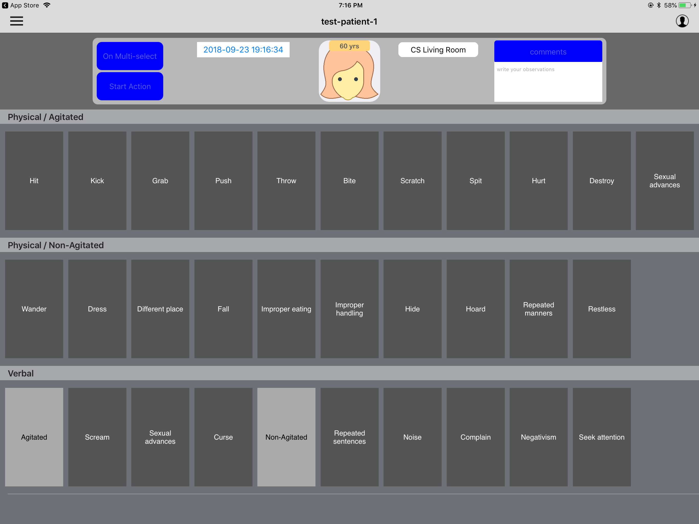

# Observer - iOS application

  

## Introduction
Behavioral symptoms of dementia classification is based on the Cohen-Mansfield Agitation Inventory, a 29-item scale 
to systematically assess agitation.
- Physical Agitation
  - Biting, hitting, kicking, pushing and scratching 
- Physical Non-Agitation
  - disrobing, hording, hiding things and improper eaating
- Verbal Agitation
  - cursing, screaming and verbal sexual advances
- Verbal Non-Agitation
  - repeated sentences, noise and attention seeking
  
Nurses and other health care professionals are burdened by the manual document entry and preserving while assessing the 
patients. This application reduces their effort by a large extent as all the behavioral actions are recorded electronically on an iPad
and the data is sent to the server which processes the data and saves to the database.

All the behaviors can be recorded as two types:
- Single events: Occurs only for that moment in time.
- Continuous events: Occurs for a period of time.

## Features
* Add new patients as well as switch between multiple patients to record their behaviors.
* Record single events by a single tap on any of the cells representing the behavior.
* Record continuous events by a double tap on any of the cells representing the behavior.
* Multiple behaviors can be recorded for continuous events.
* Either stop the continuous event for one behavior or stop for multiple behaviors.
* Patient's location is updatated automatically based on the beacons assigned to different rooms in the house.
